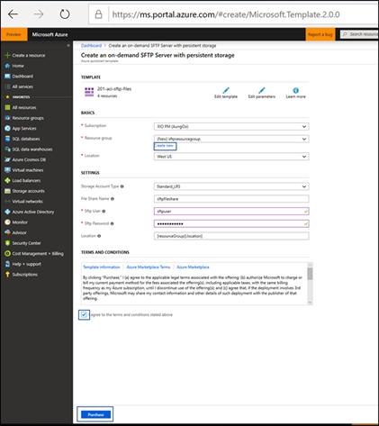
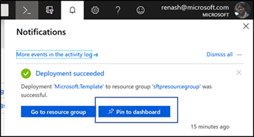
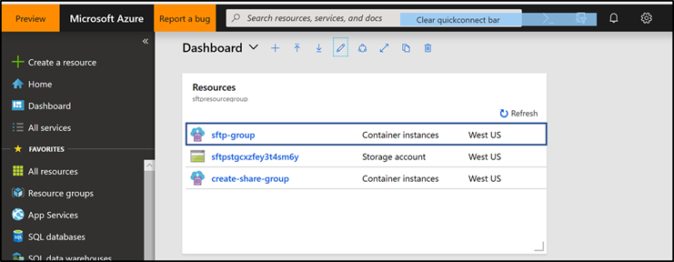
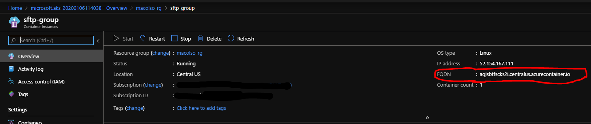
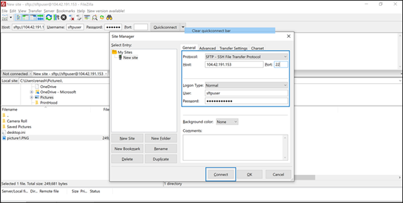
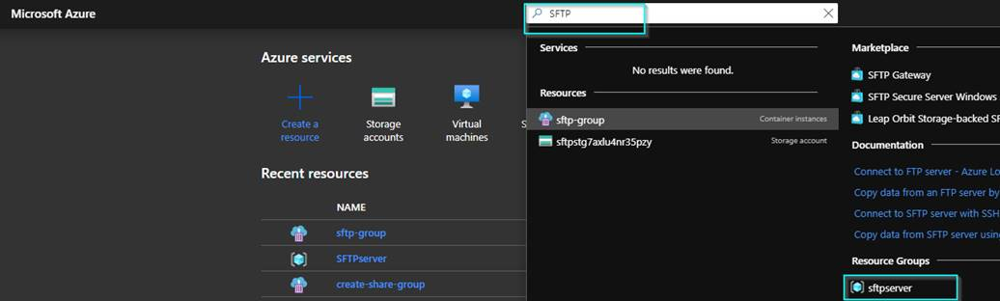
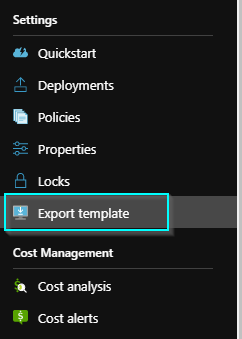
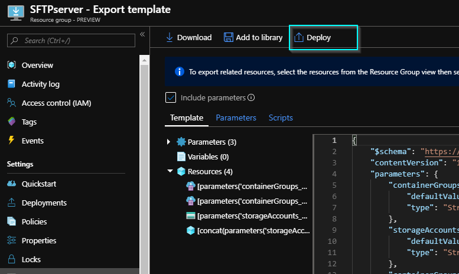
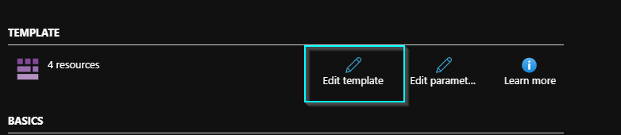

---
languages:
- json
products:
- azure
page_type: sample
description: "SFTP is a widely used protocol which many organizations use for transferring files."
---

# SFTP on Azure

SFTP is a very widely used protocol which many organizations use today for transferring files within their organization or across organizations. Creating a VM based SFTP is costly and high-maintenance. In absence of a fully managed service, this template will be a good workaround for a cost-effective SFTP solution in Azure which is backed by durable persistent storage. ACI service is very inexpensive and requires very little maintenance, while data is stored in Azure Files which is a fully managed SMB service in cloud.

## Key Value Prop

* Simple SFTP Creation
* Persistent and Durable Storage
* Cost efficient solution
* No VM maintenance overhead
* Fast to deploy

## How-To create an on-demand SFTP Server with a new Azure Files persistent storage

## How-To create an on-demand SFTP Server with an existing Azure Files persistent storage

## Overview
This template demonstrates an on-demand SFTP server using Azure Container Instances ([ACI](https://docs.microsoft.com/en-us/azure/container-instances/)). The template will generate two container groups: 
1. **create-share-group** is a container group that acts as an [init container](https://kubernetes.io/docs/concepts/workloads/pods/init-containers/) by generating the second container group and an [Azure Storage](https://docs.microsoft.com/en-us/azure/storage/common/storage-account-overview) account (based on the [101-aci-storage-file-share template](https://github.com/Azure/azure-quickstart-templates/tree/master/101-aci-storage-file-share)) 
2. **sftp-group** is a container group with a mounted [Azure File Share](https://docs.microsoft.com/en-us/azure/storage/files/storage-how-to-create-file-share). The Azure File Share will provide persistent storage after the container is terminated.

`Tags: Azure Container Instance, az-cli, sftp`

### Deployment steps

Click the "Deploy to Azure" button at the beginning of this document or follow the instructions for command line deployment using the scripts in the root of this repository.

Fill in the information

1.  Choose the subscription you want to create the sftp service in

2.  Create a new Resource Group

3.  It will automatically create a storage account of specified **Redundancy**

4.  Give a **File Share Name**

5.  Provide a **SFTP user name**

6.  Provide a **SFTP password**

7.  Click on **I agree to terms and conditions above**

8.  Click **Purchase**

>   cid:image011.png\@01D4AC19.C75D08F0

Pin to the dashboard

>   cid:image012.png\@01D4AC19.C75D08F0

## Usage

Once deployed, connect Azure to the Filezilla client via the fully qualified domain name (FQDN) of the ACI container group named **sftp-group** and upload files. 

:bangbang: ACI _does not_ support static IPs for their container groups. Use the container group's FQDN for consistent network connectivity :bangbang: 

After connecting to **sftp-group**'s FQDN, these files should be placed into the Azure File Share. Once transfers are complete, [manually stop](https://docs.microsoft.com/bs-latn-ba/azure/container-instances/container-instances-stop-start#stop) the **sftp-group** to pause ACI's billing. The files will remain accessible. You can [manually start](https://docs.microsoft.com/bs-latn-ba/azure/container-instances/container-instances-stop-start#start)  **sftp-group** and to copy more files at anytime. If you choose to delete and redeploy **sftp-group** make sure to update the FQDN connection on Filezilla since this template randomly generates the FQDN during deployment time. 

1. Click on the container sftp-group

2. Copy the FQDN from the container group

3. Open Filezilla and open File Site Manager and enter the FQDN, username and
password that was originally added during creation

4. Upload a file

5. The file appears in your file share

    

### Troubleshoot - Lost Password

## Steps to Update Password
Selected the resource group and go to the SFTP server.

 

Click on the “ Export Template” icon.

 

 

 

 

 

 

 

Under “ EnvironmentVariables” changes could be made to the username and
password.

 

 

Once changes are done redeploy it again. 

### Notes

Azure Container Instances is available in selected [locations](https://docs.microsoft.com/en-us/azure/container-instances/container-instances-quotas#region-availability). Please use one of the available location for Azure Container Instances resource.
The container image used by this template is hosted on [Docker Hub](https://hub.docker.com/r/atmoz/sftp). It is not affiliated with Microsoft in any way, and usage is at your own risk.
