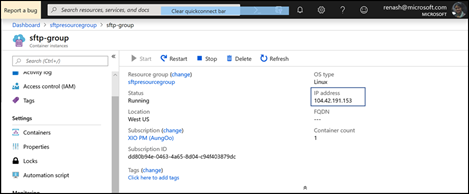
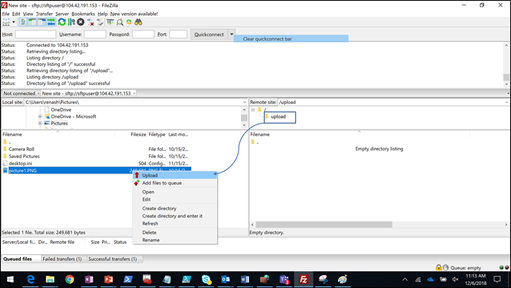
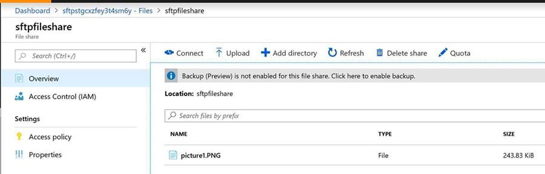

# SFTP on Azure

SFTP is a very widely used protocol which many organizations use today for transferring files within their organization or across organizations. Creating a VM based SFTP is costly and high-maintenance. In absence of a fully managed service, this template will be a good workaround for a cost-effective SFTP solution in Azure which is backed by durable persistent storage. ACI service is very inexpensive and requires very little maintenance, while data is stored in Azure Files which is a fully managed SMB service in cloud. 

# Key Value Prop

* Simple SFTP Creation
* Persistent and Durable Storage
* Cost efficient solution
* No VM maintenance overhead
* Fast to deploy

# How-To create an on-demand SFTP Server with a new Azure Files persistent storage

# How-To create an on-demand SFTP Server with an existing Azure Files persistent storage

# Overview
This template demonstrates an on-demand SFTP server using an Azure Container Instance (ACI). It creates a Storage Account and a File Share via the Azure CLI using another ACI (based on the 101-aci-storage-file-share template also in this repository). This File Share is then mounted into the main ACI to provide persistent storage after the container is terminated.

`Tags: Azure Container Instance, az-cli, sftp`

## Deployment steps

Click the "Deploy to Azure" button at the beginning of this document or follow the instructions for command line deployment using the scripts in the root of this repository.

Fill in the information

1.  Choose the subscription you want to create the sftp service in

2.  Create a new Resource Group

3.  It will automatically create a storage account of specified **Redundancy**

4.  Give a **File Share Name**

5.  Provide a **SFTP user name**

6.  Provide a **SFTP password**

7.  Click on **I agree to terms and conditions above**

8.  Click **Purchase**

>   cid:image011.png\@01D4AC19.C75D08F0

 

Pin to the dashboard

 

>   cid:image012.png\@01D4AC19.C75D08F0

 

## Usage

Once deployed, connect to the public IP of the SFTP ACI and upload files; these files should be placed into the File Share. Once transfers are complete, stop the ACI and the files will remain accessible. You can delete/recreate the ACI and mount the same file share to copy more files.

Click on the container sftp-group

 

Copy the IP address from the container group

 

Open Filezilla and open File Site Manager and enter the IP, username and
password that was originally added during creation

 

Upload a file

>    

1.  The file appears in your file share

    

## Notes

Azure Container Instance is available in selected [locations](https://docs.microsoft.com/en-us/azure/container-instances/container-instances-quotas#region-availability). Please use one of the available location for Azure Container Instance resource.
The container image used by this template is hosted on [Docker Hub](https://hub.docker.com/r/atmoz/sftp). It is not affiliated with Microsoft in any way, and usage is at your own risk.
